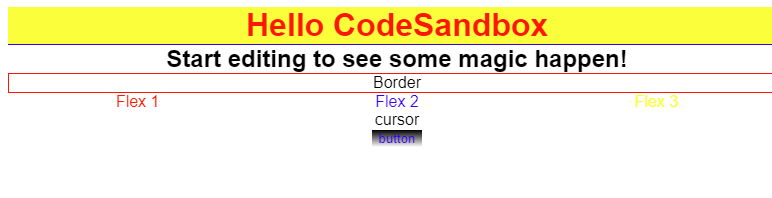

# magic-css

Build Flexbox without using any fancy framework

## How it works

MagicCss stands to make Front-End application without using any fancy and heavy frameworks. It can be used both
client-side and server-side rendering applications.

Here's [example](https://codesandbox.io/s/priceless-shannon-9er3d) and plain [html](example.html)

### Installation

```shell
npm i @frontend-ninjas/magic-css --save
```

### Import

```js
import MagicCss from '@frontend-ninjas/magic-css';
```

### Configuration

```js
const magic = new MagicCss({
  fontFamily: 'sans-serif',
  colors: [
    // 'color' - direct colors supported by default CSS
    'blue',
    'yellow',
    'grey',
    // ['color-name', 'hex/rgb/hsl']
    ['red', '#ff0000'],
    ['opacity-05', 'rgba(255,255,255,0.5)'],
    ['hsl-example', 'hsl(0deg 100% 50% / 39%)'],
  ],
  variables: [
    // ['property', 'css-value']
    ['border', '1px solid red'],
    ['border-bottom', '1px solid blue'],
    // ['property', ['identity', 'css-value']]
    ['border', [2, '1px solid black']],
    ['border', ['blue', '1px solid blue']],
    ['border-bottom', ['h1', '2px solid red']],
    // gradient background example
    ['background', ['gradient', 'linear-gradient(180deg, #000 0%, #fff 100%)']],
  ],
});
```

### Use it!

```js
const magicCss = document.createElement('style');
magicCss.innerHTML = magic.getStyle();
document.head.append(magicCss);
```

```js
export default function App() {
  return (
    <div className="App">
      <h1 className="col-red bg-yellow border-bottom">Hello CodeSandbox</h1>
      <h2>Start editing to see some magic happen!</h2>
      <div className="border">Border</div>
      <div className="flex-center justify-around">
        <p className="col-red">Flex 1</p>
        <p className="col-blue">Flex 2</p>
        <p className="col-yellow">Flex 3</p>
      </div>
      <div className="cursor">cursor</div>
      <button className="background-gradient col-blue">button</button>
    </div>
  );
}
```

